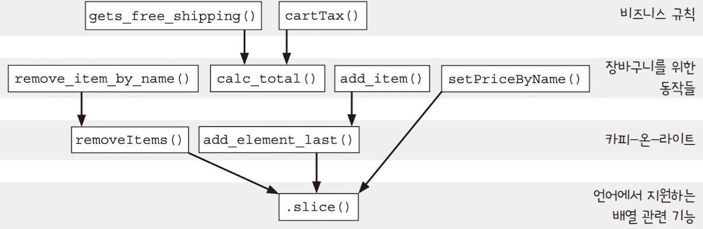
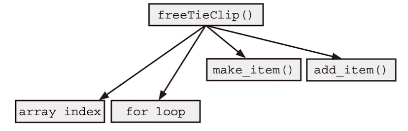
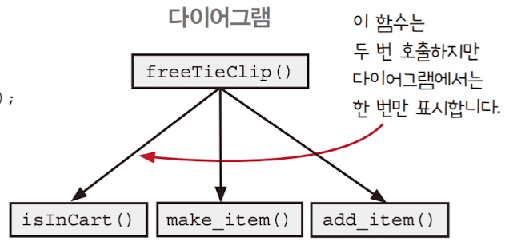
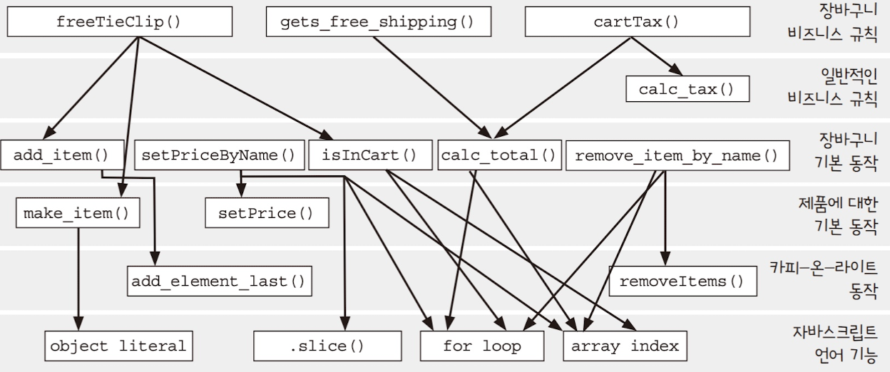

# chp8. 계층형 설계 I

소프트웨어가 커질수록 코드를 이해하고 관리하기 어려워집니다. 이때 도움이 되는 방법이 계층형 설계입니다. 코드를 역할에 따라 계층으로 나누면 각 계층은 자신이 맡은 일에만 집중할 수 있고, 다른 부분의 세부 사항을 신경 쓰지 않아도 됩니다.

이번 장에서는 계층형 설계의 첫 번째 패턴인 직접 구현을 살펴봅니다.

## 1. 계층형 설계란?

**계층형 설계**는 소프트웨어 시스템을 여러 **계층**으로 나누어 각 계층이 특정 역할을 담당하도록 하는 설계 방식입니다.

아래 그림처럼, 각 계층은 서로 다른 목적과 추상화 수준을 갖습니다.



계층형 설계에서 자주 쓰이는 패턴은 다음 네 가지입니다.

1. 직접 구현: 함수 본문을 적절한 구체화 수준으로 만들기
2. 추상화 벽: 인터페이스로 세부 구현을 감추기
3. 작은 인터페이스: 인터페이스를 최소한으로 만들기
4. 편리한 계층: 필요할 때 계층을 새로 추가하기

이번 장에서는 첫 번째 패턴인 **직접 구현**을 살펴봅니다.

## 패턴 1. 직접 구현

다음 함수는 **넥타이를 구매하면 넥타이 클립을 무료로 주는** 기능을 구현한 예시입니다.

```jsx
function freeTieClip(cart) {
    var hasTie = false;
    var hasTieClip = false;
    for (var i = 0; i < cart.length; i++) {
        var item = cart[i];
        if (item.name === "tie")
            // 넥타이 확인
            hasTie = true;
        if (item.name === "tie clip")
            // 넥타이 클립 확인
            hasTieClip = true;
    }
    if (hasTie && !hasTieClip) {
        var tieClip = make_item("tie clip", 0);
        return add_item(cart, tieClip);
    }
    return cart;
}
```

겉보기엔 단순하지만, 장바구니 배열을 순회하는 코드, 상품 확인 로직, 장바구니 추가 로직이 모두 섞여 있습니다. 즉, 서로 다른 **구체화 수준의 코드가 혼재**해 있어 이해하기 어렵습니다.

이를 **호출 그래프**로 표현하면 추상화 계층이 섞여 있음을 더 명확히 볼 수 있습니다.



이를 **직접 구현 패턴**에 따라 리팩토링하면, 함수는 같은 추상화 수준의 함수들만 호출하게 됩니다.

```jsx
function freeTieClip(cart) {
    var hasTie = isInCart(cart, "tie");
    var hasTieClip = isInCart(cart, "tie clip");
    if (hasTie && !hasTieClip) {
        var tieClip = make_item("tie clip", 0);
        return add_item(cart, tieClip);
    }
    return cart;
}

function isInCart(cart, name) {
    for (var i = 0; i < cart.length; i++) {
        if (cart[i].name === name) return true;
    }
    return false;
}
```

이제 구체적인 로직은 각 계층에 맞게 나뉘었고, 코드가 더 읽기 쉽고 명확해졌습니다.



## 2. 계층의 구분

계층은 **명확한 목적**에 따라 나눌 수 있습니다.

-   비즈니스 규칙
-   장바구니 동작
-   제품 동작
-   카피-온-라이트
-   언어 기능



각 계층이 분리되어 있으면, 코드를 읽거나 수정할 때 더 낮은 수준의 세부 내용을 굳이 신경 쓰지 않아도 됩니다.

앞서 본 **직접 구현 패턴**에서도, 함수는 같은 계층에 속한 함수만 참조하는 것이 바람직합니다. 만약 하나의 함수가 여러 계층(예: 카피-온-라이트 계층 + 언어 기능 계층)을 동시에 참조한다면, 이를 한 계층만 바라보도록 리팩토링하는 것이 필요합니다.

## 3. 정리하며

**직접 구현 패턴**은 함수를 한 **구체화 단계**에 집중하도록 만드는 설계 방식입니다. 복잡한 세부 사항은 더 낮은 계층으로 내려 보내고, 함수는 같은 수준의 추상화만 다루게 합니다.

이를 통해 다음과 같은 효과를 얻을 수 있습니다.

-   코드가 단순해지고 명확해진다.
-   재사용성과 테스트 용이성이 높아진다.
-   각 계층이 독립적으로 유지되어 유지보수가 쉬워진다.

계층형 설계의 첫걸음은 바로, **하나의 함수가 하나의 추상화 수준만 바라보게 만드는 것**입니다.
