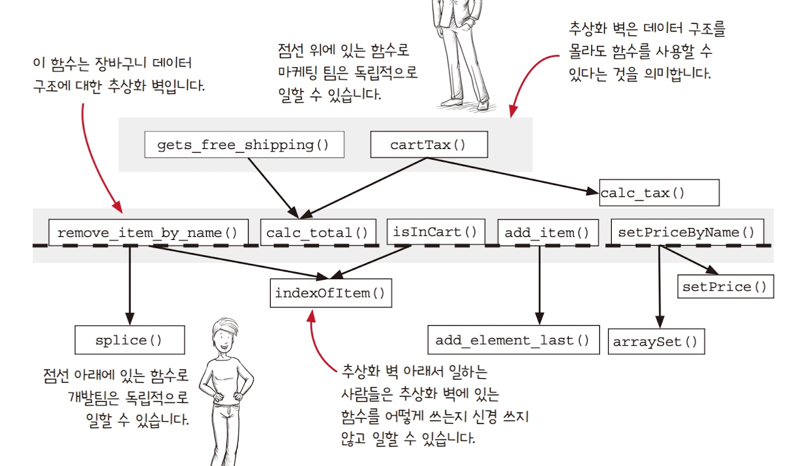
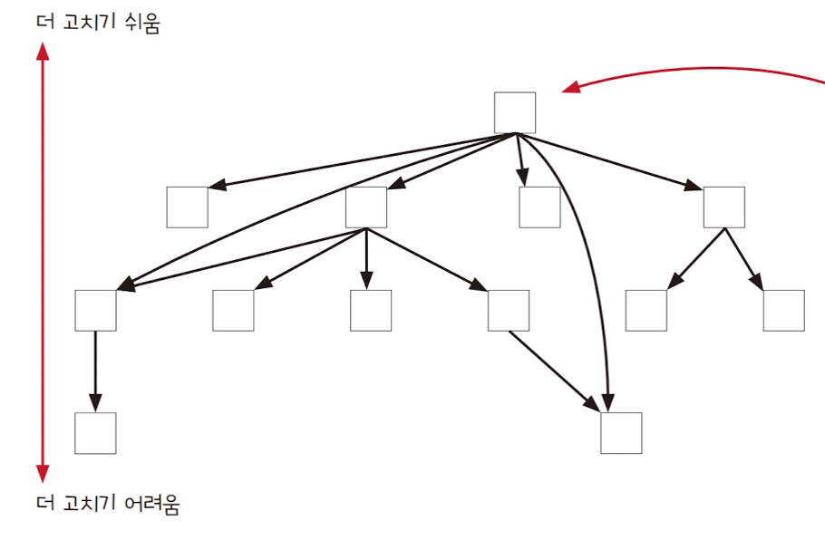

# 계층형 설계 II

지난 글에서는 **계층형 설계의 직접 구현 패턴**을 살펴보았습니다.

이번 글에서는 남은 세 가지 패턴 **추상화 벽, 작은 인터페이스, 편리한 계층** 을 통해 코드의 유지보수성, 테스트성, 재사용성을 어떻게 높일 수 있는지 알아보겠습니다.

## 1. 추상화 벽 (Abstraction Barrier)

추상화 벽은 **세부 구현을 감춘 함수 계층**입니다.

즉, 위 계층에서는 데이터 구조나 로직을 몰라도, 추상화 벽을 통해 필요한 동작만 호출할 수 있습니다.

### 1.1 장바구니 데이터 구조 바꾸기

예를 들어 장바구니 구조가 배열에서 객체로 바뀐다 해도,
상위 계층에서는 `calc_total` 같은 추상화 벽 함수만 사용하기 때문에 아무런 수정이 필요 없습니다.

이는 곧 **상·하위 계층의 독립성**을 보장해 줍니다.

### 1.2 언제 쓰면 좋을까?

- 구현을 쉽게 바꾸고 싶을 때
- 코드를 읽고 쓰기 쉽게 하고 싶을 때
- 팀 간 협업 비용을 줄이고 싶을 때
- 문제의 본질에 집중하고 싶을 때

다만, "혹시 몰라서" 불필요하게 벽을 만들면 오히려 복잡성만 늘어나니 **필요할 때만 적용**하는 것이 좋습니다.

## 2. 작은 인터페이스

새로운 함수를 추가할 때는 하위 계층에 넣기보다, **최소한의 인터페이스**를 유지하는 것이 좋습니다.

예를 들어, 장바구니에 아이템을 담는 `add_item` 함수 안에 **로그 기록 기능**을 넣으면 `add_item`이 단순 계산이 아니라 **액션**이 됩니다.
그 결과, 상위 계층에서 테스트 목적으로 `add_item`을 호출했을 때도 불필요한 로그가 남게 됩니다.

따라서 이런 부수효과는 상위 계층에서 다루고, 하위 계층은 계산에만 집중해야 합니다.

👉 즉, **추상화 벽은 작고 단순할수록 좋다**는 원칙이 여기서 드러납니다.

## 3. 편리한 계층

이 패턴은 “얼마나 계층화를 할 것인가”에 대한 실용적인 지침입니다.

- 코드가 불편하다면, 계층을 나눠 추상화를 적용합니다.
- 코드가 이미 충분히 편리하다면, 거기서 멈추면 됩니다.

즉, 계층화는 목적이 아니라 **도구**이며, 항상 "편리함"이 기준이 됩니다.

## 호출 그래프와 비기능적 요구사항

계층형 설계를 평가할 때는 **호출 그래프**를 통해 유지보수성, 테스트성, 재사용성 같은 비기능적 요구사항을 살펴볼 수 있습니다.

- **유지보수성**: 상위 계층일수록 변경의 파급 효과가 적으므로, 자주 바뀌는 비즈니스 규칙을 올려야 합니다.
- **테스트성**: 하위 계층은 변화가 적기 때문에 테스트의 가치가 오래 유지됩니다.
- **재사용성**: 범용적으로 쓰일 가능성이 큰 함수는 하위 계층에 두는 것이 효과적입니다.
  

# 마무리

이번 글에서는 계층형 설계의 세 가지 패턴을 살펴보았습니다.

- **추상화 벽**: 세부 구현을 숨겨 계층 간 독립성을 높인다.
- **작은 인터페이스**: 불필요한 액션을 배제하고 계산 로직을 단순하게 유지한다.
- **편리한 계층**: 코드가 편리해질 때까지만 계층화를 적용한다.

궁극적으로 이 모든 패턴의 목적은 **복잡성을 줄이고, 코드의 수명과 생산성을 높이는 것**입니다.
다음에 계층형 설계를 적용할 때는 “이게 지금 편리한가?”라는 질문을 꼭 던져 보시기 바랍니다.
