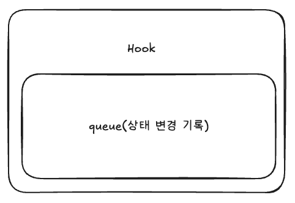
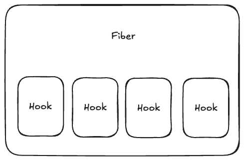

# 6. useState의 구성 요소

> 이번 챕터에선 `useState`가 마운트 시점에 어떻게 정의되는지 분석하여 훅 객체와 Fiber의 Queue, Linked List 구조를 파악합니다.


초기 마운트 시점에 호출되는 `mountState`는 간략히 다음과 같습니다.

```jsx
// /react/packages/react-reconciler/src/ReactFiberHooks.js

function mountState<S>(
  initialState: (() => S) | S,
): [S, Dispatch<BasicStateAction<S>>] {
  // 1. 새로운 Hook 객체를 생성하고 초기값 설정
  const hook = mountStateImpl(initialState);
  const queue = hook.queue;
  
  // 2. setState 역할을 하는 dispatch 함수 생성 및 반환
  // ...
  return [hook.memoizedState, dispatch];
}
```

이 과정에서 호출되는 `mountStateImpl` 를 파고들면  `mountWorkInProgressHook` 에서 훅 객체 구현을 확인할 수 있습니다.

```jsx
function mountWorkInProgressHook(): Hook {
  const hook: Hook = {
    memoizedState: null, // 실제 화면에 반영될 상태 값
    baseState: null,
    baseQueue: null,
    queue: null,         // 업데이트 기록(setState 호출들)을 담는 큐
    next: null,          // 다음 훅을 가리키는 포인터 (Linked List)
  };

  if (workInProgressHook === null) {
    // 해당 컴포넌트(Fiber)의 첫 번째 훅인 경우, 시작점으로 등록
    currentlyRenderingFiber.memoizedState = workInProgressHook = hook;
  } else {
    // 이미 존재하는 훅 뒤에 새로운 훅을 체인처럼 연결
    workInProgressHook = workInProgressHook.next = hook;
  }
  return workInProgressHook;
}
```

### 2. 설계의 핵심: Queue와 Linked List

`Hook` 객체가 가진 `queue`와 **`next`** 프로퍼티는 리액트 상태 관리의 두 가지 핵심 원칙을 구현한 것입니다.

### **Queue: 상태 업데이트의 인과관계 보장**

각 훅은 자신만의 독립적인 큐(Queue) 구조를 가집니다. 사용자가 `setState`를 여러 번 호출하더라도 그 기록을 큐에 순서대로 저장(FIFO)함으로써, 상태 변경의 순서를 정확하게 유지할 수 있습니다.



### **Linked List: 훅 호출 순서에 의한 식별**

리액트 훅은 별도의 ID를 가지지 않습니다. 

대신 각 훅 객체들이 `next` 포인터로 연결된 링크드 리스트(Linked List) 구조를 가집니다. 리액트는 이 물리적인 연결 순서에 의존하여, 몇 번째 `useState` 호출이 어떤 상태값인지 식별합니다.



## 참고자료

- https://www.youtube.com/watch?v=7mU7ARgrpfI&list=PLpq56DBY9U2B6gAZIbiIami_cLBhpHYCA&index=7
- https://goidle.github.io/react/in-depth-react-hooks_1/