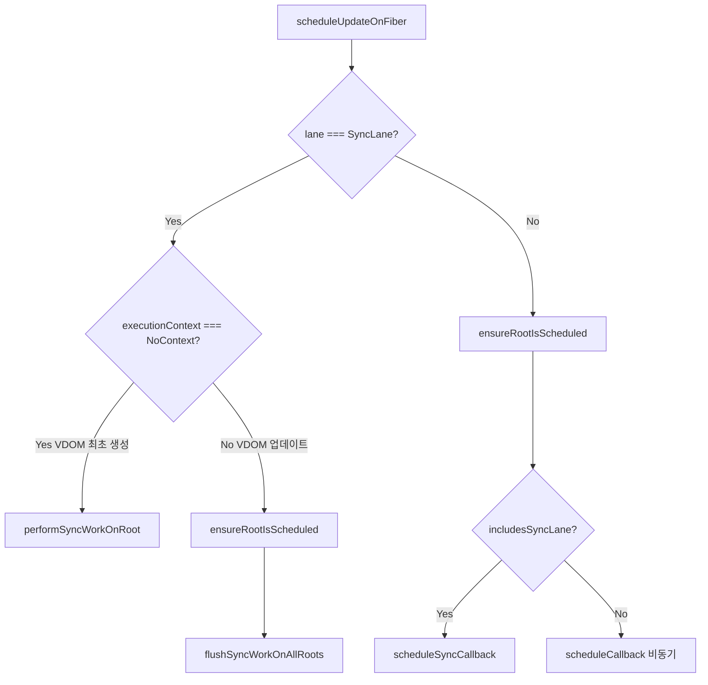

# 13. scheduleUpdateOnFiber와 동기/비동기 작업 처리

> 이번 챕터에선 Reconciler와 Scheduler 패키지가 어떻게 의존성을 낮추면서 작업을 주고받는지, `scheduleUpdateOnFiber` 함수를 통한 동기/비동기 작업 처리 방식을 분석합니다.

## 1. 패키지 간 의존성 최소화

React의 설계 원칙 중 하나는 **패키지 간 의존성을 최소화**하는 것입니다. Reconciler와 Scheduler는 서로의 코드를 직접 호출하지 않으며, 이는 각 패키지가 독립적으로 존재하고 재사용될 수 있도록 합니다.

`scheduleUpdateOnFiber`는 Reconciler가 Scheduler에게 작업을 전달하기 위한 **입구 역할**을 하는 함수입니다.

```javascript
// Reconciler → scheduleUpdateOnFiber → Scheduler
```

Reconciler가 이 함수를 호출하면, 내부적으로 다른 함수를 거쳐 Scheduler에게 작업이 전달됩니다. Scheduler 코드가 직접 호출되지 않아도 작업 전달이 가능합니다.

## 2. 동기 작업 처리

### VDOM 최초 생성

```javascript
// react/packages/react-reconciler/src/ReactFiberWorkLoop.js

export function scheduleUpdateOnFiber(
  root: FiberRoot,
  fiber: Fiber,
  lane: Lane,
) {
  // lane이 SyncLane인지 확인
  if (lane === SyncLane) {
    if (executionContext === NoContext) {
      // VDOM 최초 생성 (The initial mount of React DOM render)
      performSyncWorkOnRoot(root);
      return;
    }
  }

  // 루트 스케줄링
  ensureRootIsScheduled(root);
}
```

`lane`이 `SyncLane`이고 `executionContext`가 `NoContext`인 경우, VDOM이 최초로 생성되는 시점입니다. `performSyncWorkOnRoot` 함수를 호출하여 VDOM 생성을 즉시 완료시킵니다.

### VDOM 업데이트

VDOM이 이미 생성되었고 추가 업데이트가 필요한 경우입니다.

```javascript
// react/packages/react-reconciler/src/ReactFiberWorkLoop.js

if (executionContext === NoContext) {
  // Reconciler가 현재 다른 작업을 수행하고 있지 않을 때
  ensureRootIsScheduled(root);

  // 동기 작업이라면 즉시 flush
  if (includesSyncLane(root, lane)) {
    flushSyncWorkOnAllRoots();
  }
}
```

`ensureRootIsScheduled` 함수를 통해 루트가 스케줄링되었는지 확인하고, `executionContext === NoContext`일 때 (Reconciler가 쉬고 있을 때) 동기 lane이 포함되어 있다면 `flushSyncWorkOnAllRoots` 함수를 호출하여 저장된 동기 작업을 즉시 처리합니다.

## 3. 비동기 작업 처리

```javascript
// react/packages/react-reconciler/src/ReactFiberWorkLoop.js

export function scheduleUpdateOnFiber(
  root: FiberRoot,
  fiber: Fiber,
  lane: Lane,
) {
  // lane이 SyncLane이 아닌 경우 (비동기 작업)
  if (lane !== SyncLane) {
    ensureRootIsScheduled(root);
  }
}
```

동기 작업과 달리 비동기 작업 처리에서는 `ensureRootIsScheduled` 함수를 호출합니다.

### ensureRootIsScheduled의 역할

```javascript
// react/packages/react-reconciler/src/ReactFiberWorkLoop.js

function ensureRootIsScheduled(root: FiberRoot) {
  // 가장 높은 우선순위의 lane을 가져옴
  const nextLanes = getNextLanes(
    root,
    root === workInProgressRoot ? workInProgressRootRenderLanes : NoLanes,
  );

  if (nextLanes === NoLanes) {
    // 처리할 작업이 없음
    return;
  }

  // lane의 우선순위를 EventPriority로 변환
  const newCallbackPriority = getHighestPriorityLane(nextLanes);
  const existingCallbackPriority = root.callbackPriority;

  // 이미 스케줄링된 작업과 우선순위가 같으면 재사용
  if (existingCallbackPriority === newCallbackPriority) {
    return;
  }

  // 기존 콜백 취소
  if (existingCallbackNode !== null) {
    cancelCallback(existingCallbackNode);
  }

  // 새로운 콜백 스케줄링
  let newCallbackNode;
  if (includesSyncLane(nextLanes)) {
    // 동기 작업
    scheduleSyncCallback(performSyncWorkOnRoot.bind(null, root));
    newCallbackNode = null;
  } else {
    // 비동기 작업
    const schedulerPriorityLevel = lanesToEventPriority(nextLanes);
    newCallbackNode = scheduleCallback(
      schedulerPriorityLevel,
      performConcurrentWorkOnRoot.bind(null, root),
    );
  }

  root.callbackPriority = newCallbackPriority;
  root.callbackNode = newCallbackNode;
}
```

`ensureRootIsScheduled` 함수는 동기 및 비동기 작업 모두에서 호출되며, 스케줄링과 관련된 로직을 실행합니다.

- `getNextLanes`로 처리할 lane을 가져옴
- `getHighestPriorityLane`으로 가장 높은 우선순위를 확인
- 동기 lane이 포함되어 있으면 `scheduleSyncCallback` 호출
- 비동기 lane이면 `scheduleCallback`으로 Scheduler에 작업 등록
- 적절한 타이밍에 작업이 실행되도록 보장

이처럼 React 패키지는 의존성을 분리하는 방식으로 설계되어 있어, 패키지의 독립성 유지, 코드 재사용성 향상, 유지보수 용이성을 증대시킵니다.

## 4. Lane 기반 작업 처리 흐름



| 작업 유형           | 조건                      | 처리 함수                           | 설명                     |
| ------------------- | ------------------------- | ----------------------------------- | ------------------------ |
| **동기 (최초)**     | SyncLane + NoContext      | `performSyncWorkOnRoot`             | VDOM 최초 생성, 즉시 실행 |
| **동기 (업데이트)** | SyncLane + context OK     | `ensureRootIsScheduled` + Flush     | 동기 작업 즉시 처리      |
| **비동기**          | lane !== SyncLane         | `ensureRootIsScheduled` + Scheduler | 스케줄러에 작업 등록     |

## 5. Lane과 우선순위 매핑

```javascript
// react/packages/react-reconciler/src/ReactEventPriorities.js

export function lanesToEventPriority(lanes: Lanes): EventPriority {
  const lane = getHighestPriorityLane(lanes);

  if (lane === SyncLane) {
    return DiscreteEventPriority;
  }

  if ((lane & InputContinuousLane) !== NoLane) {
    return ContinuousEventPriority;
  }

  if ((lane & DefaultLane) !== NoLane) {
    return DefaultEventPriority;
  }

  return IdleEventPriority;
}
```

Lane을 Scheduler의 EventPriority로 변환하여, Scheduler가 적절한 우선순위로 작업을 실행하도록 합니다.

## 참고자료

- https://www.youtube.com/watch?v=7mU7ARgrpfI&list=PLpq56DBY9U2B6gAZIbiIami_cLBhpHYCA&index=7
- https://goidle.github.io/react/in-depth-react-hooks_1/
- [React Lanes 모델 소개](https://github.com/facebook/react/pull/18796)
