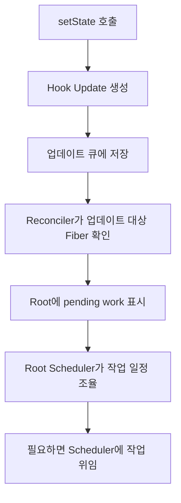

# 10. 훅 상태 업데이트 요약 및 스케줄러 개관

> 이번 챕터에선 훅 상태 업데이트가 발생한 뒤 React 내부에서 Reconciler와 Scheduler가 어떤 역할을 나누어 갖는지 큰 흐름으로 살펴봅니다.

앞선 챕터에서는 `useState`가 상태를 저장하고, `setState`가 호출되었을 때 업데이트가 큐에 쌓이는 과정을 살펴봤습니다.

이제 관심사는 다음 단계입니다. 상태 업데이트가 발생한 뒤 React는 이 작업을 **언제**, **어떤 우선순위로**, **어떤 방식으로** 렌더링할지 결정해야 합니다.

## 1. 상태 업데이트 이후의 큰 흐름

훅에서 상태 업데이트가 발생하면 React는 대략 다음 흐름으로 이동합니다.

여기서 중요한 점은 `setState`가 곧바로 화면을 다시 그리는 것이 아니라는 점입니다.

React는 먼저 업데이트 정보를 모으고, 어떤 root에서 작업이 필요한지 표시한 뒤, 우선순위에 따라 실행 시점을 결정합니다.

## 2. Reconciler의 역할

Reconciler는 "무슨 작업이 필요한가"를 정리합니다.

주요 역할은 다음과 같습니다.

1. 어떤 Fiber에서 업데이트가 발생했는지 확인합니다.
2. 해당 업데이트가 어떤 우선순위인지 lane으로 표시합니다.
3. 업데이트가 발생한 Fiber에서 root까지 정보를 전파합니다.
4. root에 pending work가 있음을 기록합니다.

즉 Reconciler는 렌더링 작업의 **대상과 우선순위**를 정리하는 역할을 합니다.

## 3. Scheduler의 역할

Scheduler는 "언제 실행할 것인가"를 담당합니다.

React의 모든 작업을 즉시 실행하면 사용자 입력이나 브라우저 렌더링이 밀릴 수 있습니다. 그래서 우선순위가 낮은 작업은 잠시 미루고, 더 급한 작업이 들어오면 먼저 처리할 수 있어야 합니다.

Scheduler는 이런 실행 타이밍을 관리합니다.

- 급한 작업은 빠르게 처리합니다.
- 덜 급한 작업은 브라우저 상황에 따라 나누어 처리할 수 있습니다.
- 긴 작업 중간에는 브라우저에게 제어권을 돌려줄 수 있습니다.

## 4. Root Scheduler의 위치

Reconciler와 Scheduler 사이에서는 Root Scheduler 흐름이 중요합니다.

Root Scheduler는 root 단위로 pending work를 관리합니다. 업데이트가 발생한 root를 전역 schedule에 등록하고, 마이크로태스크에서 각 root의 다음 작업을 확인합니다.

정리하면 다음과 같습니다.

| 역할 | 담당 |
| --- | --- |
| 업데이트 대상 확인 | Reconciler |
| 우선순위 표시 | Lane |
| root 단위 작업 조율 | Root Scheduler |
| 실제 실행 타이밍 조절 | Scheduler |

## 5. 정리

1. `setState`는 곧바로 렌더링을 실행하지 않고 업데이트를 큐에 저장합니다.
2. Reconciler는 업데이트가 발생한 Fiber와 root를 찾고 우선순위를 표시합니다.
3. Root Scheduler는 root 단위로 처리해야 할 작업을 조율합니다.
4. Scheduler는 작업을 언제 실행할지 결정합니다.
5. 이후 챕터에서는 이 흐름을 lane, root schedule, task queue 관점에서 나누어 살펴봅니다.

## 참고자료

- https://www.youtube.com/watch?v=7mU7ARgrpfI&list=PLpq56DBY9U2B6gAZIbiIami_cLBhpHYCA&index=10
