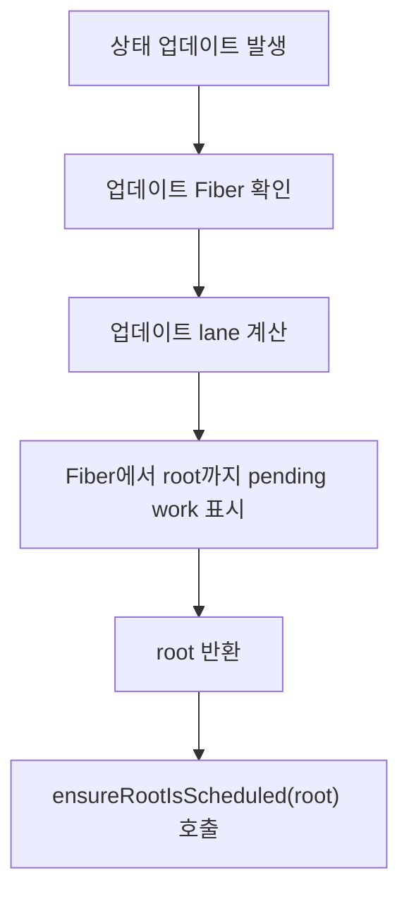

# 11. Reconciler의 스케줄링 사전 작업

> 이번 챕터에선 상태 업데이트가 발생했을 때 Reconciler가 Scheduler에 작업을 넘기기 전 어떤 준비를 하는지 살펴봅니다.

Scheduler가 작업의 실행 시점을 결정하려면, 먼저 Reconciler가 "어떤 root에 어떤 우선순위의 작업이 생겼는지"를 정리해야 합니다.

이 흐름은 **lane과 root schedule**을 기준으로 이해하는 편이 자연스럽습니다.

## 1. 업데이트는 Fiber에서 시작된다

상태 업데이트는 특정 컴포넌트의 Fiber에서 시작됩니다.

하지만 React는 컴포넌트 하나만 보고 스케줄링하지 않습니다. 최종적으로는 앱의 root 단위로 작업을 조율합니다.

따라서 업데이트가 발생하면 Reconciler는 다음 과정을 거칩니다.

1. 업데이트가 발생한 Fiber를 확인합니다.
2. 해당 업데이트의 lane을 계산합니다.
3. Fiber에서 root까지 올라가며 pending work를 표시합니다.
4. root를 스케줄링 대상으로 등록합니다.

## 2. lane을 기록하는 이유

lane은 업데이트의 우선순위를 나타내는 값입니다.

예를 들어 사용자 입력처럼 즉시 반응해야 하는 작업과, 화면 전환처럼 조금 미뤄도 되는 작업은 같은 우선순위로 처리될 필요가 없습니다.

Reconciler는 업데이트가 발생하면 해당 업데이트에 lane을 부여하고, root까지 이 정보를 전파합니다.

이렇게 해두면 React는 나중에 root를 확인할 때 "지금 가장 먼저 처리해야 하는 lane이 무엇인지" 판단할 수 있습니다.

## 3. root까지 정보를 올리는 흐름

Reconciler의 사전 작업은 한 문장으로 정리할 수 있습니다.

> 업데이트가 발생한 Fiber에서 root까지 올라가며, 이 root에 처리해야 할 작업이 있음을 표시합니다.

이 과정 덕분에 React는 개별 컴포넌트 업데이트를 root 단위의 스케줄링 문제로 바꿀 수 있습니다.

## 4. Reconciler와 Scheduler의 경계

Reconciler는 작업을 실제로 언제 실행할지 직접 결정하지 않습니다.

Reconciler가 하는 일은 다음에 가깝습니다.

- 업데이트가 발생한 위치를 찾습니다.
- 어떤 우선순위인지 표시합니다.
- root에 pending work가 있음을 기록합니다.
- root를 스케줄링 대상으로 넘깁니다.

이후 Root Scheduler와 Scheduler가 실제 실행 시점을 조율합니다.

## 5. 정리

1. 상태 업데이트는 특정 Fiber에서 시작됩니다.
2. Reconciler는 업데이트에 lane을 부여합니다.
3. 업데이트 정보는 Fiber에서 root까지 전파됩니다.
4. root는 스케줄링의 기준 단위가 됩니다.
5. Reconciler의 역할은 작업 실행이 아니라, Scheduler가 판단할 수 있도록 정보를 정리하는 것입니다.

## 참고자료

- https://www.youtube.com/watch?v=7mU7ARgrpfI&list=PLpq56DBY9U2B6gAZIbiIami_cLBhpHYCA&index=11
