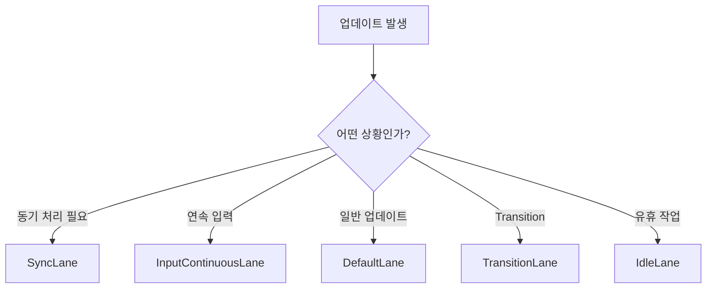

# 12. Lanes와 이벤트 우선순위

> 이번 챕터에선 React가 Lane 모델을 통해 업데이트 우선순위를 표현하고, 여러 작업을 함께 관리하는 방식을 살펴봅니다.

React는 업데이트마다 우선순위를 다르게 다룹니다.

사용자 입력처럼 즉시 반응해야 하는 작업도 있고, 화면 전환이나 백그라운드 작업처럼 조금 미뤄도 되는 작업도 있습니다.

이 우선순위를 표현하기 위해 React는 **Lane**이라는 모델을 사용합니다.

## 1. Lane이 필요한 이유

업데이트는 하나씩만 발생하지 않습니다. 여러 컴포넌트에서 동시에 업데이트가 생길 수 있고, 그중 어떤 것은 급하고 어떤 것은 덜 급합니다.

Lane은 이런 업데이트들을 우선순위별로 구분하기 위한 표시입니다.

쉽게 말하면 Lane은 작업이 달리는 차선과 같습니다.

- 급한 작업은 빠른 lane에 들어갑니다.
- 일반 작업은 기본 lane에 들어갑니다.
- 여유 있을 때 처리해도 되는 작업은 낮은 우선순위 lane에 들어갑니다.

## 2. 대표적인 Lane 흐름

React 내부에는 여러 lane이 있지만, 큰 흐름에서는 다음 정도로 이해할 수 있습니다.

| 종류 | 의미 |
| --- | --- |
| `SyncLane` | 즉시 처리해야 하는 동기 작업 |
| `InputContinuousLane` | 스크롤, 드래그처럼 연속적으로 발생하는 입력 |
| `DefaultLane` | 일반적인 업데이트 |
| `TransitionLane` | `startTransition` 등으로 낮춰진 전환 작업 |
| `IdleLane` | 여유 있을 때 처리할 작업 |

업데이트가 발생하면 React는 현재 상황을 보고 적절한 lane을 선택합니다.

## 3. 이벤트 우선순위와 Lane

React는 브라우저 이벤트의 성격에 따라 우선순위를 다르게 봅니다.

예를 들어 클릭이나 키보드 입력은 사용자가 즉각적인 반응을 기대하는 이벤트입니다. 반면 일반적인 비동기 업데이트는 조금 늦게 처리되어도 괜찮을 수 있습니다.

이벤트 우선순위는 lane으로 바뀌고, 이후 root 스케줄링의 기준이 됩니다.

| 이벤트 성격 | 예시 | 대응되는 흐름 |
| --- | --- | --- |
| 즉시 반응 필요 | 클릭, 키 입력 | 높은 우선순위 lane |
| 연속 입력 | 스크롤, 드래그 | 연속 입력 lane |
| 일반 작업 | 일반 상태 업데이트 | 기본 lane |
| 유휴 작업 | 낮은 우선순위 작업 | idle lane |

## 4. Lane의 장점

Lane 모델의 장점은 여러 작업을 한 번에 표현할 수 있다는 점입니다.

예전처럼 하나의 숫자만으로 우선순위를 표현하면, 여러 우선순위의 작업이 동시에 섞였을 때 관리가 복잡해집니다.

Lane은 비트마스크 기반이기 때문에 여러 lane을 하나의 값 안에 함께 담을 수 있습니다.

즉 React는 root에 쌓인 여러 작업 중에서 지금 처리할 lane을 고르고, 나머지는 남겨둘 수 있습니다.

## 5. 정리

1. Lane은 React 업데이트의 우선순위를 표현하는 모델입니다.
2. 업데이트가 발생하면 React는 상황에 맞는 lane을 선택합니다.
3. 이벤트의 성격에 따라 높은 우선순위 또는 낮은 우선순위 lane이 배정됩니다.
4. Lane은 여러 작업을 함께 표현할 수 있어 root 단위 스케줄링에 적합합니다.
5. 이후 Root Scheduler는 pending lane 중 지금 처리할 lane을 선택합니다.
