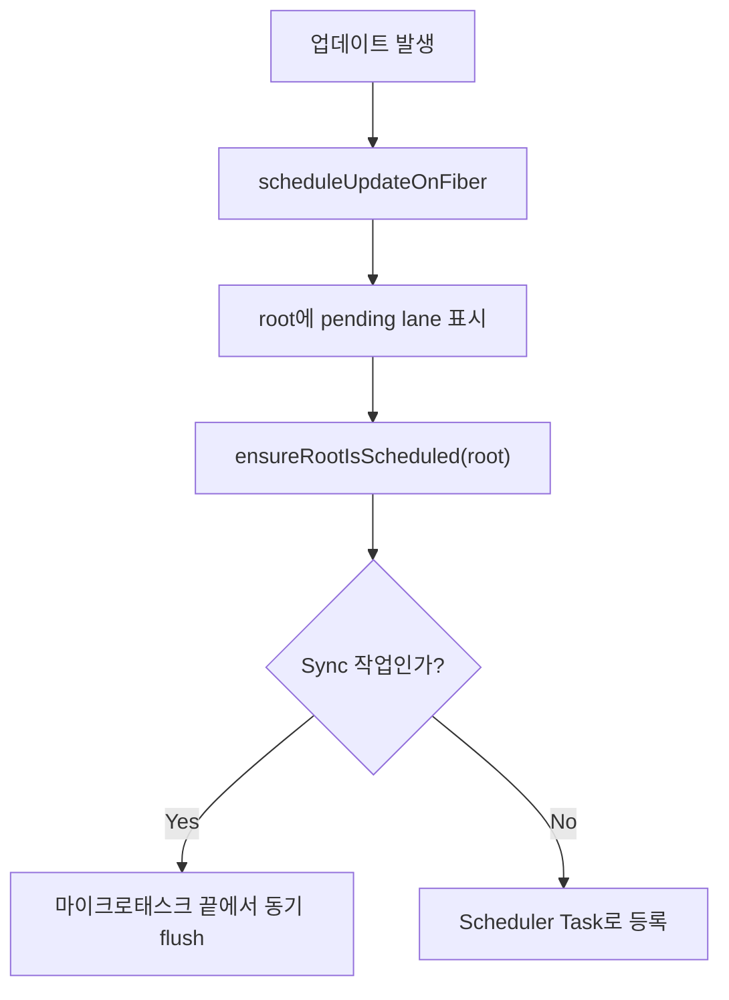

# 13. scheduleUpdateOnFiber와 작업 등록 흐름

> 이번 챕터에선 `scheduleUpdateOnFiber`가 업데이트된 Fiber를 root 스케줄링 흐름으로 연결하는 역할을 살펴봅니다.

상태 업데이트가 발생하면 React는 해당 업데이트를 단순히 컴포넌트 내부에서만 처리하지 않습니다.

업데이트가 발생한 Fiber를 기준으로 root를 찾고, root에 pending work를 표시한 뒤, root가 스케줄링되도록 연결합니다.

이 흐름의 중심에 있는 함수가 `scheduleUpdateOnFiber`입니다.

## 1. scheduleUpdateOnFiber의 역할

`scheduleUpdateOnFiber`는 이름 그대로 특정 Fiber에서 발생한 업데이트를 스케줄링 흐름에 올리는 입구입니다.

큰 역할은 다음과 같습니다.

1. 업데이트가 발생한 root를 확인합니다.
2. 업데이트 lane을 root에 표시합니다.
3. 현재 렌더링 중인 작업과 충돌할 수 있는지 확인합니다.
4. root가 스케줄링되도록 `ensureRootIsScheduled`로 연결합니다.

즉 이 함수는 "업데이트가 생겼으니 이 root를 다시 확인해야 한다"는 신호를 React 내부에 남깁니다.

## 2. Sync 작업과 Concurrent 작업

React의 업데이트는 모두 같은 방식으로 처리되지 않습니다.

`SyncLane`처럼 즉시 처리해야 하는 작업은 가능한 빠르게 flush되어야 합니다. 반면 일반 업데이트나 Transition 작업은 Scheduler를 통해 나누어 처리될 수 있습니다.

큰 흐름은 다음과 같습니다.

Sync Work도 root schedule에 등록된 뒤, 마이크로태스크 마지막에 flush되는 흐름을 가집니다.

Concurrent Work는 Scheduler Task로 등록되어 브라우저 상황에 따라 실행될 수 있습니다.

## 3. Reconciler와 Scheduler를 잇는 지점

`scheduleUpdateOnFiber`는 Reconciler 내부의 함수입니다.

하지만 이 함수의 결과는 Scheduler 흐름으로 이어집니다. Reconciler가 작업 대상과 우선순위를 정리하면, Root Scheduler가 root 단위로 작업을 확인하고, 필요한 경우 Scheduler에 실행을 위임합니다.

정리하면 다음과 같습니다.

| 단계 | 역할 |
| --- | --- |
| `scheduleUpdateOnFiber` | 업데이트된 Fiber를 root 스케줄링으로 연결 |
| `ensureRootIsScheduled` | root를 전역 schedule에 등록 |
| `scheduleTaskForRootDuringMicrotask` | root의 다음 작업과 우선순위 판단 |
| Scheduler | Concurrent Work의 실제 실행 시점 조율 |

## 4. 정리

1. `scheduleUpdateOnFiber`는 업데이트를 root 스케줄링 흐름에 올리는 입구입니다.
2. 업데이트가 발생한 Fiber에서 root까지 정보가 모입니다.
3. root에는 처리해야 할 lane이 pending work로 기록됩니다.
4. `ensureRootIsScheduled`를 통해 root가 다음 스케줄링 단계에서 검토됩니다.
5. Sync Work는 빠르게 flush되고, Concurrent Work는 Scheduler에 의해 실행 시점이 조율됩니다.
