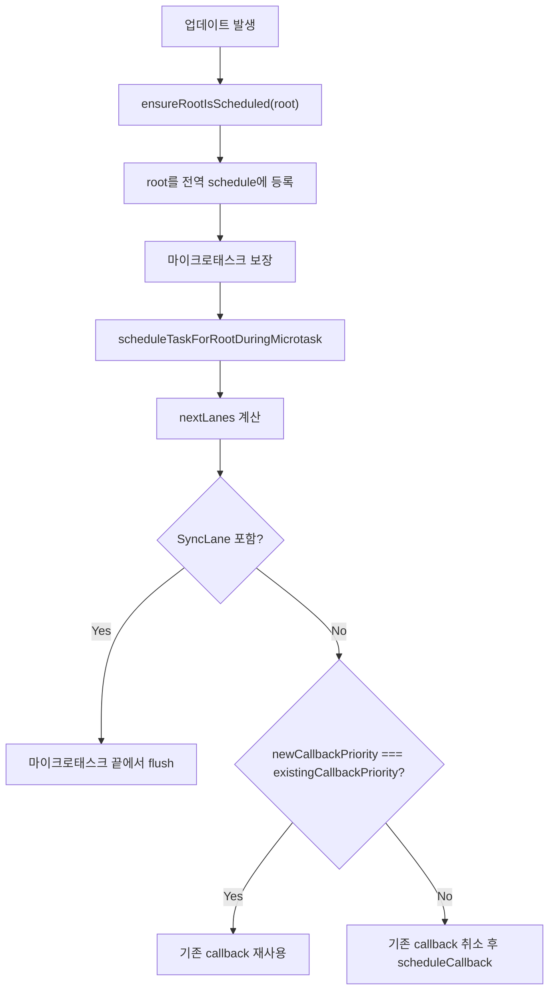

# 14. ensureRootIsScheduled와 루트 스케줄 관리

> 이번 챕터에선 `ensureRootIsScheduled`가 실제로 무엇을 하는지, 그리고 callback 우선순위 비교가 어디서 일어나는지 분석합니다.

`ensureRootIsScheduled`는 **root를 전역 스케줄 목록에 등록하고, 이를 처리할 마이크로태스크를 보장**합니다. 실제 callback 재사용/취소/재등록 판단은 `scheduleTaskForRootDuringMicrotask`에서 일어납니다.

## 1. ensureRootIsScheduled의 역할

```javascript
// /packages/react-reconciler/src/ReactFiberRootScheduler.js

export function ensureRootIsScheduled(root: FiberRoot): void {
  if (root === lastScheduledRoot || root.next !== null) {
    // 이미 root schedule 안에 있음
  } else if (lastScheduledRoot === null) {
    firstScheduledRoot = lastScheduledRoot = root;
  } else {
    lastScheduledRoot.next = root;
    lastScheduledRoot = root;
  }

  mightHavePendingSyncWork = true;
  ensureScheduleIsScheduled();
}
```

이 함수가 하는 일은 두 가지입니다.

1. root를 전역 root schedule 연결 리스트에 넣습니다.
2. 그 schedule을 처리할 마이크로태스크가 예약되도록 보장합니다.

즉 `ensureRootIsScheduled`는 "이 root를 다음 스케줄링 턴에서 반드시 검토하게 만드는 함수"라고 볼 수 있습니다.

## 2. 실제 우선순위 비교는 어디서 일어날까?

실제 비교는 `processRootScheduleInMicrotask()`가 각 root를 순회하며 호출하는 `scheduleTaskForRootDuringMicrotask(root, currentTime)`에서 일어납니다.

```javascript
// /packages/react-reconciler/src/ReactFiberRootScheduler.js
// React 19.2 기준 개념 설명용 축약 코드

function scheduleTaskForRootDuringMicrotask(root, currentTime) {
  markStarvedLanesAsExpired(root, currentTime);

  const nextLanes = getNextLanes(
    root,
    root === workInProgressRoot ? workInProgressRootRenderLanes : NoLanes,
    rootHasPendingCommit,
  );

  const existingCallbackNode = root.callbackNode;
  const existingCallbackPriority = root.callbackPriority;
  const newCallbackPriority = getHighestPriorityLane(nextLanes);
}
```

여기서 보는 핵심 값은 다음 세 가지입니다.

- `nextLanes`: 지금 root에서 가장 먼저 처리해야 할 lane 집합
- `existingCallbackPriority`: 현재 callback이 대표하는 우선순위
- `newCallbackPriority`: `nextLanes` 중 가장 높은 우선순위 lane

즉 React는 **lane 집합 중 가장 높은 priority lane** 을 기준으로 callback priority를 정합니다.

## 3. callback은 언제 재사용하고, 언제 취소할까?

비동기 경로에서는 `root.callbackPriority`와 새로 계산한 `newCallbackPriority`를 비교합니다.

```javascript
// /packages/react-reconciler/src/ReactFiberRootScheduler.js
// React 19.2 기준 개념 설명용 축약 코드

const existingCallbackPriority = root.callbackPriority;
const newCallbackPriority = getHighestPriorityLane(nextLanes);

if (newCallbackPriority === existingCallbackPriority) {
  return newCallbackPriority; // 기존 task 재사용
}

cancelCallback(existingCallbackNode); // priority가 달라지면 기존 task 취소
```

정리하면 다음과 같습니다.

- `newCallbackPriority`가 같으면 기존 task를 재사용합니다.
- 다르면 기존 task를 취소하고 새 task를 등록합니다.

핵심 질문은 "새 work가 더 급한가?"보다 **"이 root를 대표하는 최고 priority lane이 바뀌었는가?"** 입니다.

## 4. SyncLane과 비동기 lane의 차이

Sync work는 별도의 Scheduler task를 새로 만들지 않습니다.

```javascript
if (includesSyncLane(nextLanes) && !checkIfRootIsPrerendering(root, nextLanes)) {
  if (existingCallbackNode !== null) {
    cancelCallback(existingCallbackNode);
  }

  root.callbackPriority = SyncLane;
  root.callbackNode = null;
  return SyncLane;
}
```

이 경우 work는 마이크로태스크 마지막에 `flushSyncWorkOnAllRoots()`로 즉시 flush됩니다.

반대로 비동기 lane은 `lanesToEventPriority(nextLanes)`로 Scheduler priority를 정한 뒤 `scheduleCallback(...)`으로 등록합니다.

| Lane/EventPriority | Scheduler priority |
| --- | --- |
| `DiscreteEventPriority` | `UserBlockingPriority` |
| `ContinuousEventPriority` | `UserBlockingPriority` |
| `DefaultEventPriority` | `NormalPriority` |
| `IdleEventPriority` | `IdlePriority` |

## 5. 흐름으로 다시 정리



## 6. 정리

1. `ensureRootIsScheduled`의 역할은 root를 schedule에 등록하고 마이크로태스크를 보장하는 것입니다.
2. 실제 callback 우선순위 비교는 `scheduleTaskForRootDuringMicrotask`에서 일어납니다.
3. React는 lane 집합 중 가장 높은 priority lane으로 callback priority를 결정합니다.
4. `newCallbackPriority`가 같으면 기존 task를 재사용하고, 다르면 취소 후 새 task를 등록합니다.
5. sync work는 별도 task를 만들지 않고 마이크로태스크 끝에서 flush됩니다.

## 참고자료

- https://www.youtube.com/watch?v=7mU7ARgrpfI&list=PLpq56DBY9U2B6gAZIbiIami_cLBhpHYCA&index=12
- https://goidle.github.io/react/in-depth-react-scheduler_1/
