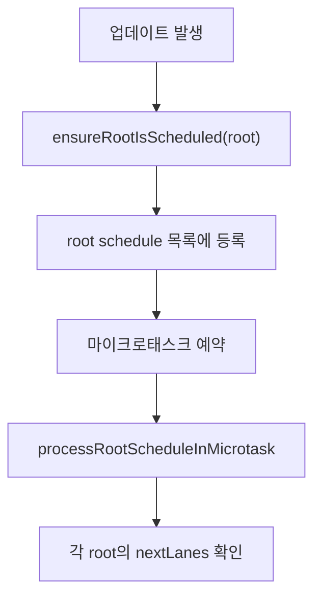

# 14. ensureRootIsScheduled와 루트 스케줄 관리

> 이번 챕터에선 `ensureRootIsScheduled`가 root를 스케줄링 대상으로 등록하고, 이후 우선순위 판단이 어떤 흐름으로 이어지는지 살펴봅니다.

업데이트가 발생하면 React는 개별 Fiber만 다시 보는 것이 아니라, 해당 Fiber가 속한 root를 기준으로 작업을 조율합니다.

`ensureRootIsScheduled`는 이 root를 전역 root schedule에 등록하는 역할을 합니다.

## 1. ensureRootIsScheduled의 핵심 역할

`ensureRootIsScheduled`의 역할은 크게 두 가지입니다.

1. 업데이트가 발생한 root를 전역 schedule 목록에 넣습니다.
2. 이 목록을 처리할 마이크로태스크가 예약되도록 보장합니다.

즉 이 함수는 직접 렌더링을 실행하는 함수가 아닙니다.

대신 "이 root에 처리해야 할 일이 있으니 다음 스케줄링 단계에서 반드시 확인하라"는 표시를 남깁니다.

## 2. root schedule이 필요한 이유

React 앱에는 하나 이상의 root가 있을 수 있습니다.

각 root는 서로 다른 pending work를 가질 수 있고, 각 작업의 우선순위도 다를 수 있습니다.

그래서 React는 업데이트가 발생한 root들을 전역 목록으로 관리한 뒤, 마이크로태스크에서 순회하며 다음 작업을 결정합니다.

## 3. 실제 우선순위 판단은 어디서 할까?

`ensureRootIsScheduled`는 root를 등록하는 역할에 가깝습니다.

실제 우선순위 판단은 이후 마이크로태스크에서 각 root를 순회할 때 이루어집니다.

이때 React는 다음을 확인합니다.

1. 이 root에 처리할 lane이 남아 있는가?
2. 가장 높은 우선순위 lane은 무엇인가?
3. 기존에 예약된 callback을 재사용할 수 있는가?
4. Sync Work인지 Concurrent Work인지?

이 판단을 통해 기존 작업을 유지하거나, 취소하고 새 작업을 등록하거나, 동기 작업을 flush 대상으로 표시합니다.

## 4. Sync Work와 Concurrent Work의 분기

root의 다음 작업이 Sync Work라면 별도의 Scheduler Task를 만들지 않습니다.

대신 마이크로태스크 마지막에 동기 작업을 flush합니다.

반대로 Concurrent Work라면 lane 우선순위를 Scheduler priority로 바꾸고, Scheduler에 Task로 등록합니다.

| 작업 종류 | 처리 방식 |
| --- | --- |
| Sync Work | 마이크로태스크 마지막에 flush |
| Concurrent Work | Scheduler Task로 등록 |

## 5. 정리

1. `ensureRootIsScheduled`는 root를 전역 schedule에 등록합니다.
2. 이 함수는 직접 렌더링을 실행하지 않습니다.
3. 실제 작업 판단은 마이크로태스크에서 root 목록을 순회하며 이루어집니다.
4. React는 root의 pending lane을 보고 다음에 처리할 작업을 선택합니다.
5. Sync Work는 빠르게 flush되고, Concurrent Work는 Scheduler에 등록됩니다.
