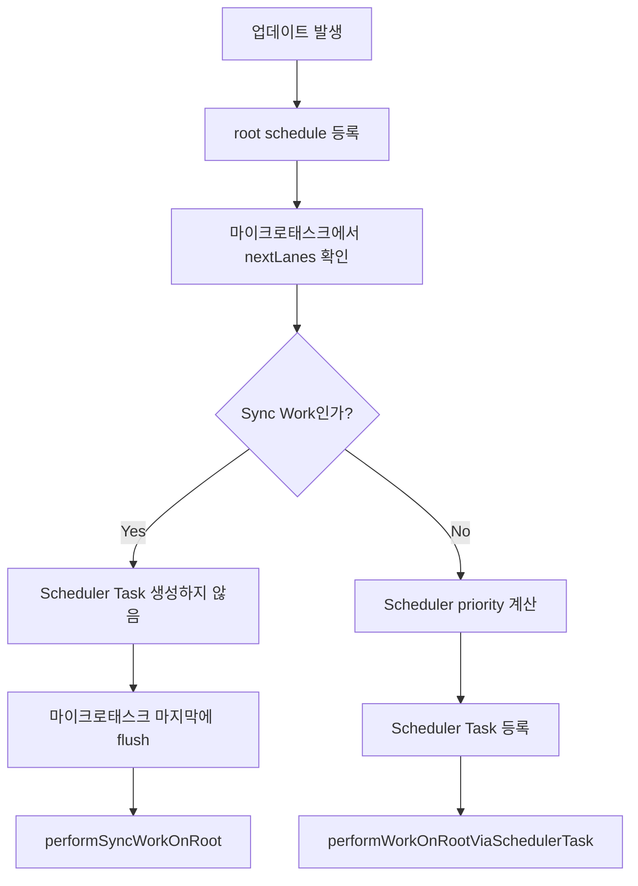

# 15. Concurrent Work와 Sync Work의 스케줄링 차이

> 이번 챕터에선 Concurrent Work와 Sync Work가 어떤 기준으로 나뉘고, 각각 어떤 경로로 처리되는지 살펴봅니다.

React의 업데이트는 모두 같은 방식으로 실행되지 않습니다.

어떤 작업은 즉시 처리되어야 하고, 어떤 작업은 브라우저 상황에 맞춰 나누어 처리될 수 있습니다.

이 차이를 이해하면 Scheduler가 왜 필요한지, 그리고 Sync Work는 왜 Scheduler Task로 만들지 않는지 이해할 수 있습니다.

## 1. Sync Work란?

Sync Work는 빠르게 반영되어야 하는 작업입니다.

예를 들어 사용자가 입력한 결과처럼 즉각적인 반응이 필요한 업데이트는 오래 미루면 사용자 경험이 나빠집니다.

Sync Work는 별도의 Scheduler Task를 만들지 않고, Root Scheduler의 마이크로태스크 마지막에 flush됩니다.

즉 Sync Work는 "Scheduler에게 실행 시점을 맡긴다"기보다는, **현재 스케줄링 턴 안에서 빠르게 처리되도록 보장**됩니다.

## 2. Concurrent Work란?

Concurrent Work는 우선순위 조정과 중단, 재개가 가능한 작업입니다.

이 작업은 Scheduler에 Task로 등록될 수 있습니다.

Scheduler는 브라우저의 작업 시간을 고려하면서, 작업을 이어서 할지 잠시 멈출지 판단합니다.

이 덕분에 긴 렌더링 작업 중에도 사용자 입력 같은 더 급한 작업이 들어올 여지가 생깁니다.

## 3. 두 경로의 차이

두 작업의 차이는 다음처럼 정리할 수 있습니다.

| 구분 | Sync Work | Concurrent Work |
| --- | --- | --- |
| 목적 | 즉시 반영 | 우선순위에 따라 조율 |
| 실행 방식 | 마이크로태스크 마지막에 flush | Scheduler Task로 등록 |
| 중단/재개 | 중요하지 않음 | 가능 |
| 대표 흐름 | `performSyncWorkOnRoot` | `performWorkOnRootViaSchedulerTask` |
| 핵심 기준 | 빠른 처리 | 브라우저와 우선순위 조율 |

## 4. 전체 흐름

## 5. 왜 경로를 나눌까?

모든 작업을 동기적으로 처리하면 빠르게 반영되지만, 긴 작업이 브라우저를 오래 점유할 수 있습니다.

반대로 모든 작업을 Scheduler에 맡기면 유연성은 커지지만, 즉시 처리되어야 하는 작업까지 지연될 수 있습니다.

그래서 React는 작업의 성격에 따라 경로를 나눕니다.

- 급한 작업은 Sync Work로 빠르게 처리합니다.
- 조율 가능한 작업은 Concurrent Work로 Scheduler에 넘깁니다.

## 6. 정리

1. Sync Work는 즉시 반영이 중요한 작업입니다.
2. Sync Work는 별도의 Scheduler Task를 만들지 않고 마이크로태스크 마지막에 flush됩니다.
3. Concurrent Work는 Scheduler Task로 등록되어 실행 시점이 조율됩니다.
4. Scheduler는 Concurrent Work를 처리하면서 브라우저에게 제어권을 돌려줄 수 있습니다.
5. 두 경로의 핵심 차이는 "즉시 flush할 것인가, Scheduler에게 실행 시점을 맡길 것인가"입니다.
