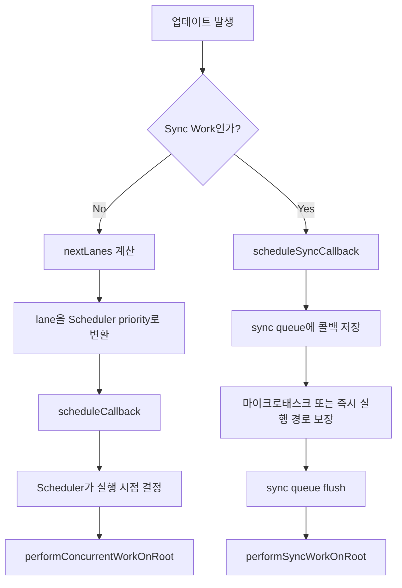

# 15. Concurrent Work와 Sync Work의 스케줄링 차이

> 이번 챕터에선 Fiber 아키텍처 이후 React가 `Concurrent Work`와 `Sync Work`를 어떤 경로로 처리하는지, 그리고 `scheduleCallback`과 `scheduleSyncCallback`의 역할 차이를 정리합니다.

React에서 모든 작업이 동일한 방식으로 실행되는 것은 아닙니다. Fiber 아키텍처 이후에는 작업의 성격에 따라 서로 다른 스케줄링 경로를 사용합니다.

이 문서에서는 다음과 같이 구분합니다.

- `Concurrent Work`: 우선순위 조정이 가능한 작업
- `Sync Work`: 우선순위 조정보다 즉시 실행이 중요한 작업

## 1. Fiber 아키텍처와 작업 분리

Fiber 이전의 스택 기반 렌더링은 한 번 시작한 작업을 중간에 멈추거나 우선순위를 다시 계산하기 어려웠습니다. 등록된 작업이 순차적으로 동기 실행되는 구조에 가까웠기 때문입니다.

Fiber 아키텍처가 도입된 이후 React는 다음과 같은 처리가 가능해졌습니다.

1. 수행 중인 work를 중단하고 다시 시작할 수 있습니다.
2. 더 높은 우선순위의 work가 들어오면 기존 work의 우선순위를 다시 평가할 수 있습니다.
3. 작업의 성격에 따라 동기 경로와 동시성 경로를 구분할 수 있습니다.

이 변화로 인해 React는 Sync Work와 Concurrent Work를 서로 다른 방식으로 처리하게 되었습니다.

## 2. `scheduleCallback`과 Concurrent Work

Concurrent Work는 우선순위 조정이 가능한 작업입니다. 따라서 Reconciler가 직접 실행 시점을 결정하지 않고 Scheduler에 work 수행을 위임합니다.

```javascript
// /packages/react-reconciler/src/ReactFiberRootScheduler.js
// 개념 설명용 축약 코드

const newCallbackNode = scheduleCallback(
  schedulerPriorityLevel,
  performConcurrentWorkOnRoot.bind(null, root),
);
```

이 흐름의 핵심은 다음과 같습니다.

1. Reconciler가 `nextLanes`를 계산합니다.
2. 가장 높은 lane 우선순위를 Scheduler priority로 변환합니다.
3. `scheduleCallback(...)`으로 Scheduler에게 실행을 맡깁니다.
4. Scheduler는 브라우저 상태와 현재 우선순위를 고려해 work를 실행합니다.

즉 Concurrent Work 경로에서는 Reconciler가 **무슨 작업을 해야 하는지 계산**하고, Scheduler가 **언제 실행할지 결정**합니다.

## 3. `scheduleSyncCallback`과 Sync Work

Sync Work는 즉시 실행이 중요한 작업입니다. 이 경로에서는 우선순위 재조정보다 빠른 flush가 더 중요하므로, Scheduler에 우선순위 판단을 맡기지 않고 Reconciler가 직접 sync queue를 관리합니다.

```javascript
// /packages/react-reconciler/src/ReactFiberSyncTaskQueue.js
// 개념 설명용 축약 코드

let syncQueue = null;

export function scheduleSyncCallback(callback) {
  if (syncQueue === null) {
    syncQueue = [callback];
  } else {
    syncQueue.push(callback);
  }
}
```

`scheduleSyncCallback`은 Scheduler에게 우선순위 결정을 위임하는 함수가 아닙니다. Sync Work를 내부 queue에 저장하고, 이후 적절한 시점에 flush될 수 있도록 준비하는 역할을 합니다.

```javascript
// React 내부 흐름 개념 설명

scheduleSyncCallback(performSyncWorkOnRoot.bind(null, root));
// 이후 마이크로태스크 또는 즉시 실행 경로에서 sync queue flush
```

실제 구현 세부사항은 버전에 따라 조금씩 달라질 수 있지만, 개념은 같습니다.

- sync callback 자체는 Reconciler가 관리합니다.
- queue를 비우는 시점만 마이크로태스크나 즉시 실행 경로를 통해 보장합니다.
- 이 위임은 우선순위 재조정을 위한 것이 아니라, flush 타이밍 확보를 위한 것입니다.

## 4. 두 경로의 차이

두 함수는 이름이 비슷하지만 책임이 다릅니다.

| 구분 | `scheduleCallback` | `scheduleSyncCallback` |
| --- | --- | --- |
| 대상 work | `Concurrent Work` | `Sync Work` |
| 실행 방식 | 비동기적 스케줄링 | 동기 queue 등록 |
| 우선순위 판단 주체 | Scheduler | Reconciler |
| 우선순위 재조정 | 가능 | 사실상 불필요 |
| 중단 / 양보 | 가능 | 불가능하거나 의미 없음 |
| 핵심 목적 | 실행 시점 결정 위임 | sync queue 등록 |

정리하면 `scheduleCallback`은 실행 시점을 Scheduler에게 넘기는 함수이고, `scheduleSyncCallback`은 sync queue에 콜백을 저장하는 함수입니다.

## 5. 처리 흐름



위 흐름에서 볼 수 있듯이 Concurrent Work는 Scheduler를 통해 실행되고, Sync Work는 Reconciler의 sync queue를 통해 관리됩니다.

## 6. 정리

1. Fiber 아키텍처는 work를 중단, 재개, 재우선순위화할 수 있게 만들었습니다.
2. Concurrent Work는 우선순위 조정이 가능하므로 `scheduleCallback`을 통해 Scheduler에 위임됩니다.
3. Sync Work는 우선순위 재조정보다 즉시 실행이 중요하므로 `scheduleSyncCallback`으로 Reconciler 내부 queue에 저장됩니다.
4. Sync 경로에서 외부 실행 메커니즘은 queue flush 타이밍을 보장할 뿐, 우선순위를 새로 판단하지는 않습니다.
5. 따라서 두 경로의 가장 큰 차이는 "우선순위 조정을 누구에게 맡기느냐"에 있습니다.

## 참고자료

- https://www.youtube.com/watch?v=7mU7ARgrpfI&list=PLpq56DBY9U2B6gAZIbiIami_cLBhpHYCA&index=13
- https://goidle.github.io/react/in-depth-react-scheduler_1/
