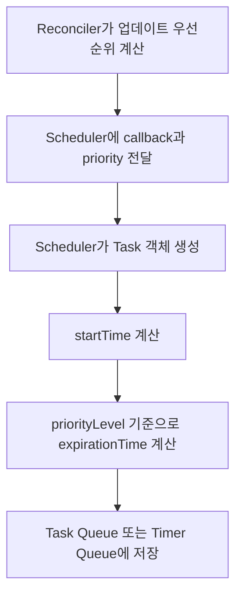

# 16. Scheduler의 Task 객체

> 이번 챕터에선 React Scheduler가 Reconciler로부터 받은 작업을 어떻게 Task 객체로 만들고, 왜 이 객체를 기준으로 작업을 관리하는지 살펴봅니다.

이전 챕터에서는 Concurrent Work와 Sync Work가 Root Scheduler에서 서로 다른 방식으로 처리된다는 점을 살펴봤습니다.

이번에는 Concurrent Work가 Scheduler로 넘어간 뒤, Scheduler 내부에서 어떤 형태로 관리되는지 큰 흐름 위주로 정리합니다.

## 1. Scheduler는 무엇을 받는가?

Reconciler는 렌더링 작업을 준비한 뒤 Scheduler에게 다음 두 가지를 넘깁니다.

1. 실행해야 하는 함수
2. 작업의 우선순위

Concurrent Work는 `performWorkOnRootViaSchedulerTask`라는 함수를 Scheduler에 넘깁니다.

```javascript
// /packages/react-reconciler/src/ReactFiberRootScheduler.js
// 개념 설명용 축약 코드

scheduleCallback(
  schedulerPriorityLevel,
  performWorkOnRootViaSchedulerTask.bind(null, root),
);
```

즉 Reconciler는 "무엇을 해야 하는지"를 정하고, Scheduler는 "언제 실행할지"를 정합니다.

## 2. Task 객체란?

Scheduler는 전달받은 함수를 바로 실행하지 않습니다. 먼저 작업을 Task 객체로 감쌉니다.

Task 객체는 하나의 예약된 작업을 표현합니다.

```javascript
// /packages/scheduler/src/forks/Scheduler.js

var newTask = {
  id: taskIdCounter++,
  callback,
  priorityLevel,
  startTime,
  expirationTime,
  sortIndex: -1,
};
```

각 값은 다음 의미를 가집니다.

| 속성 | 의미 |
| --- | --- |
| `callback` | 실제로 실행할 작업 |
| `priorityLevel` | Scheduler가 판단하는 우선순위 |
| `startTime` | 작업을 시작할 수 있는 시간 |
| `expirationTime` | 작업을 더 이상 미루면 안 되는 시간 |
| `sortIndex` | 큐에서 정렬할 때 사용하는 기준 |

핵심은 Scheduler가 작업을 단순한 함수가 아니라, **시간 정보와 우선순위를 가진 Task**로 바꾸어 관리한다는 점입니다.

## 3. startTime과 expirationTime

Task에서 가장 중요한 값은 `startTime`과 `expirationTime`입니다.

`startTime`은 작업이 실행 가능한 시점입니다. 별도의 delay가 없다면 보통 현재 시간이 됩니다.

`expirationTime`은 작업의 만료 시점입니다. 이 값은 `priorityLevel`에 따라 결정됩니다.

예를 들어 높은 우선순위 작업은 빨리 만료되도록 설정됩니다. 이렇게 하면 Scheduler가 해당 작업을 더 오래 미루지 않고 먼저 처리할 수 있습니다.

반대로 낮은 우선순위 작업은 더 늦게 만료되므로, 급한 작업이 있다면 뒤로 밀릴 수 있습니다.

## 4. delay와 timeout

정리하면 다음과 같습니다.

| 구분 | 설명 |
| --- | --- |
| Root Scheduler가 넘기는 값 | callback, priorityLevel |
| delay | Scheduler API에는 있지만 일반 렌더링 경로에서는 보통 사용하지 않음 |
| timeout | priorityLevel을 기준으로 Scheduler 내부에서 결정 |

즉 Scheduler는 전달받은 우선순위를 바탕으로 만료 시간을 계산하고, 이 값을 기준으로 작업의 급한 정도를 판단합니다.

## 5. 전체 흐름



## 6. 정리

1. Reconciler는 실행할 작업과 우선순위를 Scheduler에게 넘깁니다.
2. Scheduler는 이 작업을 Task 객체로 감싸 관리합니다.
3. Task 객체는 `callback`, `priorityLevel`, `startTime`, `expirationTime`을 가집니다.
4. `startTime`은 언제 실행할 수 있는지를 나타냅니다.
5. `expirationTime`은 얼마나 급한 작업인지를 판단하는 기준이 됩니다.
6. Scheduler는 이 Task 객체를 기준으로 작업 순서를 조절합니다.

## 참고자료

- https://www.youtube.com/watch?v=8IwUdtULaec&list=PLpq56DBY9U2B6gAZIbiIami_cLBhpHYCA&index=17
