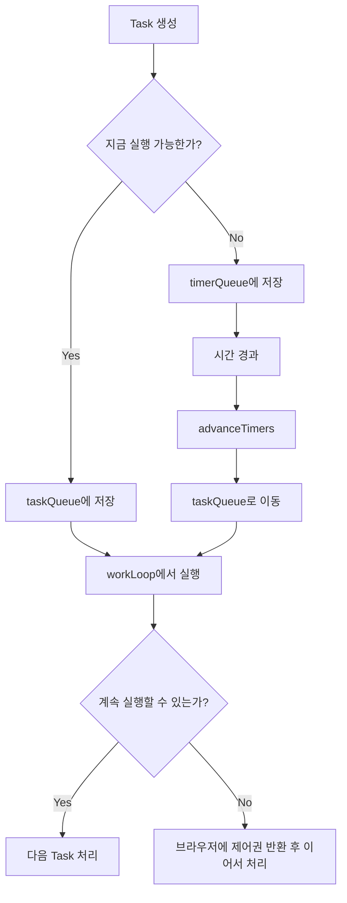

# 17. Scheduler의 Task Queue와 Timer Queue

> 이번 챕터에선 Scheduler가 Task를 `taskQueue`와 `timerQueue`로 나누어 관리하는 이유와 전체 흐름을 살펴봅니다.

이전 챕터에서는 Scheduler가 작업을 Task 객체로 만든다는 점을 살펴봤습니다.

이번에는 만들어진 Task가 어떤 큐에 들어가고, Scheduler가 이 큐들을 이용해 작업 순서를 어떻게 조절하는지 정리합니다.

## 1. 왜 큐가 두 개일까?

Scheduler가 관리하는 작업은 크게 두 종류로 나눌 수 있습니다.

1. 지금 실행할 수 있는 작업
2. 아직 실행 시간이 되지 않은 작업

이 두 작업을 하나의 큐에 섞어두면, Scheduler는 매번 "지금 실행 가능한가?"와 "얼마나 급한가?"를 함께 판단해야 합니다.

그래서 React Scheduler는 두 큐를 분리합니다.

| 큐 | 역할 | 정렬 기준 |
| --- | --- | --- |
| `taskQueue` | 지금 실행 가능한 작업 관리 | `expirationTime` |
| `timerQueue` | 아직 실행 시간이 되지 않은 작업 관리 | `startTime` |

즉 `timerQueue`는 "언제 시작할 수 있는가"를 기준으로 보고, `taskQueue`는 "얼마나 급한가"를 기준으로 봅니다.

## 2. 일반 Task와 Timer Task

Task의 `startTime`이 현재 시간보다 늦으면 아직 실행할 수 없는 작업입니다. 이런 작업은 `timerQueue`에 들어갑니다.

반대로 `startTime`이 현재 시간이거나 이미 지났다면 바로 실행 가능한 작업입니다. 이런 작업은 `taskQueue`에 들어갑니다.

```javascript
// /packages/scheduler/src/forks/Scheduler.js
// 개념 설명용 축약 코드

if (startTime > currentTime) {
  push(timerQueue, newTask);
} else {
  push(taskQueue, newTask);
}
```

이 구조를 통해 Scheduler는 "아직 기다려야 하는 작업"과 "지금 처리할 수 있는 작업"을 분리해서 관리합니다.

## 3. Timer Task는 어떻게 실행 가능해질까?

`timerQueue`에 들어간 Task는 시간이 지나면 `taskQueue`로 이동합니다.

이 역할을 하는 함수가 `advanceTimers`입니다.

```javascript
// /packages/scheduler/src/forks/Scheduler.js
// 개념 설명용 축약 코드

function advanceTimers(currentTime) {
  // startTime이 지난 Timer Task를 taskQueue로 이동
}
```

흐름은 다음과 같습니다.

1. `timerQueue`에서 가장 빨리 시작할 Task를 확인합니다.
2. `startTime`이 현재 시간보다 작거나 같으면 실행 가능한 상태로 봅니다.
3. 해당 Task를 `timerQueue`에서 꺼내 `taskQueue`로 옮깁니다.
4. 이후에는 일반 Task처럼 `expirationTime` 기준으로 처리됩니다.

즉 Timer Task는 시간이 되면 바로 실행되는 것이 아니라, 먼저 `taskQueue`로 이동한 뒤 다른 실행 가능한 작업들과 함께 우선순위가 비교됩니다.

## 4. Scheduler가 작업을 실행하는 흐름

`taskQueue`에 실행 가능한 작업이 있으면 Scheduler는 host callback을 예약합니다.

브라우저 환경에서는 보통 `MessageChannel`을 통해 다음 작업 루프가 예약됩니다.

```javascript
// /packages/scheduler/src/forks/Scheduler.js
// 개념 설명용 축약 코드

channel.port1.onmessage = performWorkUntilDeadline;

schedulePerformWorkUntilDeadline = () => {
  port.postMessage(null);
};
```

이후 `performWorkUntilDeadline`이 실행되면 Scheduler는 `workLoop`를 돌며 `taskQueue`에 있는 작업을 처리합니다.

작업을 처리하다가 브라우저에게 제어권을 돌려줘야 하는 시점이 오면 잠시 멈추고, 남은 작업은 다음 루프에서 이어서 처리합니다.

이 방식 덕분에 긴 렌더링 작업 중에도 더 급한 작업이 들어올 여지를 만들 수 있습니다.

## 5. 전체 흐름



## 6. 정리

1. Scheduler는 실행 가능한 작업과 아직 기다려야 하는 작업을 분리합니다.
2. `taskQueue`는 지금 실행 가능한 Task를 관리합니다.
3. `timerQueue`는 아직 시작 시간이 되지 않은 Task를 관리합니다.
4. 시간이 된 Timer Task는 `advanceTimers`를 통해 `taskQueue`로 이동합니다.
5. `taskQueue` 안에서는 만료 시간이 가까운 작업이 먼저 처리됩니다.
6. 작업 중간에 브라우저에게 제어권을 돌려줄 수 있기 때문에, React는 더 유연하게 업데이트 우선순위를 조절할 수 있습니다.

## 참고자료

- https://www.youtube.com/watch?v=8IwUdtULaec&list=PLpq56DBY9U2B6gAZIbiIami_cLBhpHYCA&index=17
