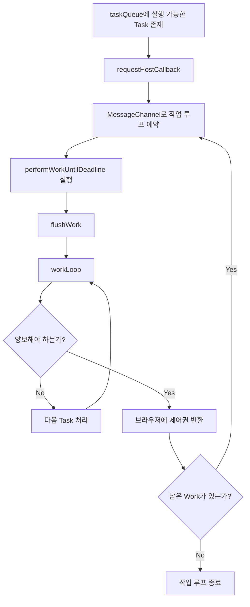

# 18. Scheduler와 메인 스레드 양보

> 이번 챕터에선 React가 왜 작업을 한 번에 끝까지 밀어붙이지 않고, 중간중간 브라우저에게 메인 스레드를 돌려주는지 살펴봅니다.

이전 챕터에서는 Scheduler가 Task를 `taskQueue`와 `timerQueue`로 나누어 관리하는 흐름을 정리했습니다.

이번에는 `taskQueue`에 들어온 작업이 실제로 처리될 때, React가 왜 작업을 잠깐 멈추고 브라우저에게 제어권을 넘기는지 살펴봅니다.

## 1. React의 Work는 화면 그리기 자체가 아니다

React에서 말하는 Work는 브라우저가 실제 픽셀을 그리는 작업과 다릅니다.

React의 Work는 주로 Fiber 트리를 만들고, 비교하고, 어떤 변경이 필요한지 계산하는 작업입니다. 즉 브라우저 입장에서는 JavaScript가 메모리 위에서 수행하는 계산 작업에 가깝습니다.

이 점이 중요합니다.

브라우저가 화면을 부드럽게 유지하려면 사용자 입력, 이벤트 처리, 레이아웃, 페인트 같은 작업도 처리해야 합니다. 그런데 React가 긴 JavaScript 작업으로 메인 스레드를 오래 점유하면, 브라우저는 그동안 사용자 입력을 즉시 처리하기 어렵습니다.

그래서 Scheduler는 긴 Work를 작은 단위로 나누고, 중간중간 브라우저에게 제어권을 돌려줍니다.

## 2. 메인 스레드를 양보한다는 뜻

브라우저의 메인 스레드는 한 번에 하나의 일만 처리할 수 있습니다.

React 작업이 오래 이어지면 다음과 같은 일이 밀릴 수 있습니다.

- 클릭, 입력, 스크롤 같은 사용자 이벤트
- 타이머 콜백
- 레이아웃 계산
- 페인트

메인 스레드를 양보한다는 것은 React가 하던 일을 완전히 버린다는 뜻이 아닙니다.

작업을 잠시 끊고, 브라우저가 더 급한 일을 처리할 수 있도록 차례를 넘긴 뒤, 남은 React 작업은 다음 작업 루프에서 이어서 처리한다는 뜻입니다.

## 3. Scheduler가 작업 시간을 나누는 방식

Scheduler는 한 번의 작업 루프에서 무한히 Task를 처리하지 않습니다.

작업 루프가 시작되면 시작 시간을 기록하고, 일정 시간이 지나면 `shouldYieldToHost`를 통해 브라우저에게 양보해야 하는지 판단합니다.

이때 기본 기준이 되는 값은 `frameYieldMs`이며, 값은 `5ms`입니다.

```javascript
// /packages/scheduler/src/SchedulerFeatureFlags.js
// 개념 설명용 축약 코드

export const frameYieldMs = 5;
```

핵심 흐름은 다음과 같습니다.

1. 작업 루프가 시작된다.
2. 시작 시간을 기록한다.
3. `taskQueue`에서 우선순위가 높은 Task를 꺼내 처리한다.
4. 시간이 너무 오래 지났는지 확인한다.
5. 더 처리할 수 있으면 다음 Task를 처리한다.
6. 양보해야 하면 작업을 멈추고 다음 루프를 예약한다.

이 구조 덕분에 React는 긴 작업을 처리하면서도 브라우저가 사용자 입력을 처리할 틈을 만들 수 있습니다.

## 4. performWorkUntilDeadline의 역할

`performWorkUntilDeadline`은 Scheduler가 예약한 작업 루프를 실제로 실행하는 함수입니다.

이 함수는 대략 다음 흐름으로 동작합니다.

1. 현재 시간을 가져온다.
2. 이 시간을 작업 루프의 시작 시간으로 기록한다.
3. `flushWork`를 호출해 `taskQueue`의 작업을 처리한다.
4. 남은 작업이 있으면 다음 작업 루프를 다시 예약한다.
5. 남은 작업이 없으면 메시지 루프를 종료한다.

즉 `performWorkUntilDeadline`은 "이번 턴에서 처리할 만큼 처리하고, 필요하면 다음 턴을 예약하는 진입점"이라고 볼 수 있습니다.

## 5. MessageChannel을 사용하는 이유

Scheduler는 실행 가능한 Task가 생기면 host callback을 예약합니다.

브라우저 환경에서는 보통 `MessageChannel`을 사용해 다음 작업 루프를 예약합니다.

```javascript
// /packages/scheduler/src/forks/Scheduler.js
// 개념 설명용 축약 코드

const channel = new MessageChannel();
channel.port1.onmessage = performWorkUntilDeadline;

schedulePerformWorkUntilDeadline = () => {
  channel.port2.postMessage(null);
};
```

`MessageChannel`은 `setTimeout`처럼 일정 시간을 기다리기 위한 도구라기보다는, 다음 JavaScript 작업을 브라우저 이벤트 루프에 넣기 위한 도구로 이해하면 좋습니다.

Scheduler는 이 방식을 이용해 Work를 한 번에 모두 처리하지 않고, 여러 번의 작업 루프로 나누어 이어갑니다.

## 6. setTimeout은 어디에 쓰일까?

`setTimeout`은 주로 지연된 Task를 깨우는 데 사용됩니다.

이전 챕터에서 봤던 `timerQueue`의 Task는 아직 `startTime`이 되지 않은 작업입니다. 가장 빠른 Timer Task의 시간이 다가오면 Scheduler는 `requestHostTimeout`을 통해 `setTimeout`을 예약합니다.

시간이 지나면 `handleTimeout`이 실행되고, 실행 가능한 Timer Task는 `advanceTimers`를 통해 `taskQueue`로 이동합니다.

정리하면 역할이 나뉩니다.

| 함수 | 주된 역할 |
| --- | --- |
| `requestHostCallback` | 실행 가능한 작업 루프 예약 |
| `requestHostTimeout` | 지연된 Task가 시작될 시점 예약 |
| `performWorkUntilDeadline` | 이번 작업 루프에서 Work 처리 |
| `shouldYieldToHost` | 브라우저에게 양보할지 판단 |

## 7. 전체 흐름



## 8. 정리

1. React의 Work는 브라우저가 화면을 그리는 작업 자체가 아니라, Fiber를 계산하는 JavaScript 작업에 가깝습니다.
2. JavaScript가 메인 스레드를 오래 점유하면 사용자 입력과 브라우저 작업이 밀릴 수 있습니다.
3. Scheduler는 작업 루프의 시작 시간을 기록하고, 일정 시간이 지나면 브라우저에게 제어권을 돌려줍니다.
4. 기본 양보 기준은 `frameYieldMs`인 `5ms`입니다.
5. 실행 가능한 작업은 `MessageChannel`을 통해 다음 작업 루프로 이어집니다.
6. 지연된 작업은 `setTimeout`을 통해 시작 시점이 되었을 때 `taskQueue`로 이동합니다.
7. 이 구조 덕분에 React는 긴 업데이트 작업 중에도 사용자 경험을 덜 막는 방향으로 작업을 나눠 처리할 수 있습니다.
