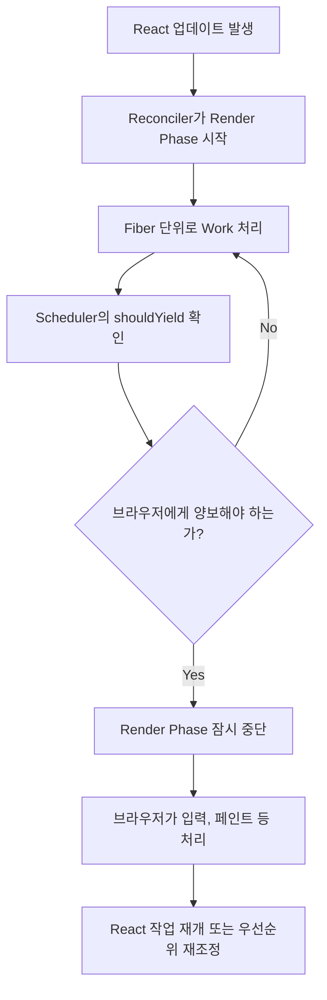

# 19. shouldYield와 양보 타이밍

> 이번 챕터에선 React가 작업을 처리하다가 "이쯤에서 브라우저에게 차례를 넘겨야겠다"고 판단하는 흐름을 살펴봅니다.

이전 챕터에서는 React가 왜 메인 스레드를 양보해야 하는지 정리했습니다.

이번에는 그 양보 타이밍을 어디서, 어떤 기준으로 판단하는지 살펴봅니다.

## 1. 문제는 긴 JavaScript 작업이다

브라우저의 메인 스레드는 여러 일을 담당합니다.

- JavaScript 실행
- 사용자 이벤트 처리
- 스타일과 레이아웃 계산
- 페인트

이 중 JavaScript 실행이 오래 이어지면, 브라우저는 사용자 입력이나 화면 갱신을 바로 처리하기 어렵습니다.

React의 Render Phase도 JavaScript 작업입니다. Fiber를 만들고, 비교하고, 다음에 커밋할 변경 사항을 계산하는 작업이기 때문입니다.

그래서 Concurrent Rendering에서는 이 작업을 한 번에 끝까지 밀어붙이지 않고, 중간에 멈출 수 있는 구조가 필요합니다.

## 2. isInputPending은 어떤 문제를 풀려고 했을까?

`isInputPending`은 브라우저 이벤트 큐에 아직 처리되지 않은 사용자 입력이 있는지 확인하는 API입니다.

```javascript
navigator.scheduling.isInputPending();
```

이 API가 해결하려는 문제는 단순합니다.

> JavaScript가 긴 작업을 수행하는 중에도, 사용자 입력이 기다리고 있는지 알 수 있다면 더 적절한 순간에 양보할 수 있다.

예를 들어 입력창에 글자를 치고 있는데 JavaScript 작업이 너무 오래 실행되면, 사용자는 키를 눌렀는데도 화면이 늦게 반응한다고 느낍니다. 이때 pending input을 감지할 수 있다면 브라우저에게 먼저 입력 처리를 맡길 수 있습니다.

다만 `isInputPending`을 React의 양보 판단 전체라고 외우면 흐름이 좁아집니다.

이 API는 양보 타이밍을 설명할 때 중요한 배경이지만, 공개된 Scheduler 구현의 핵심 판단은 `shouldYieldToHost` 안에서 시간 경과와 페인트 요청을 함께 보는 구조로 이해하는 편이 더 자연스럽습니다.

## 3. Scheduler는 shouldYieldToHost로 판단한다

Scheduler 내부에는 `shouldYieldToHost`라는 함수가 있습니다.

이 함수의 역할은 이름 그대로 "host, 즉 브라우저에게 양보해야 하는가?"를 판단하는 것입니다.

핵심은 작업 루프가 시작된 뒤 얼마나 시간이 지났는지 확인하는 것입니다.

```javascript
// /packages/scheduler/src/forks/Scheduler.js
// 개념 설명용 축약 코드

function shouldYieldToHost() {
  if (needsPaint) {
    return true;
  }

  const timeElapsed = getCurrentTime() - startTime;

  if (timeElapsed < frameInterval) {
    return false;
  }

  return true;
}
```

여기서 중요한 값은 세 가지입니다.

| 값 | 의미 |
| --- | --- |
| `startTime` | 이번 작업 루프가 시작된 시간 |
| `frameInterval` | 한 번에 메인 스레드를 점유할 수 있는 기본 시간 |
| `needsPaint` | 브라우저가 페인트를 필요로 한다는 신호 |

기본 `frameInterval`은 `frameYieldMs`에서 오며, 값은 `5ms`입니다.

즉 Scheduler는 작업을 시작한 뒤 시간이 너무 오래 지났거나, 브라우저가 페인트를 요청한 상황이면 양보할 수 있습니다.

## 4. workLoop는 양보 신호를 보고 멈춘다

Scheduler의 `workLoop`는 `taskQueue`에서 Task를 꺼내 실행합니다.

그런데 모든 Task를 끝까지 처리하지는 않습니다.

현재 Task가 아직 만료되지 않았고, `shouldYieldToHost()`가 `true`를 반환하면 루프를 멈춥니다.

```javascript
// /packages/scheduler/src/forks/Scheduler.js
// 개념 설명용 축약 코드

while (currentTask !== null) {
  if (currentTask.expirationTime > currentTime && shouldYieldToHost()) {
    break;
  }

  // 현재 Task 실행
}
```

여기서 `expirationTime` 조건이 함께 등장하는 이유도 중요합니다.

이미 만료된 급한 Task라면 가능한 한 처리해야 합니다. 반대로 아직 만료되지 않은 Task라면, 브라우저에게 양보할 수 있는 여지가 생깁니다.

즉 Scheduler는 단순히 "5ms가 지났으니 무조건 멈춘다"가 아니라, 현재 Task의 급함과 브라우저의 상태를 함께 보고 멈춥니다.

## 5. Reconciler는 shouldYield를 통해 멈출 수 있다

Scheduler의 양보 판단은 Reconciler에도 전달됩니다.

Reconciler는 Render Phase에서 Fiber를 하나씩 처리합니다. 이때 Concurrent Rendering에서는 `workLoopConcurrent`가 사용되고, 이 루프 안에서 `shouldYield()`를 확인합니다.

```javascript
// /packages/react-reconciler/src/ReactFiberWorkLoop.js
// 개념 설명용 축약 코드

function workLoopConcurrent() {
  while (workInProgress !== null && !shouldYield()) {
    performUnitOfWork(workInProgress);
  }
}
```

`shouldYield()`가 `true`가 되면 Render Phase는 잠시 멈출 수 있습니다.

이후 브라우저가 필요한 일을 처리하고 나면, React는 남은 Fiber 작업을 이어서 진행하거나, 더 높은 우선순위의 업데이트가 들어온 경우 작업을 다시 조정할 수 있습니다.

## 6. 전체 흐름



## 7. 정리

1. React가 양보 타이밍을 고민하는 이유는 긴 JavaScript 작업이 메인 스레드를 막을 수 있기 때문입니다.
2. `isInputPending`은 처리되지 않은 사용자 입력을 감지하기 위해 등장한 브라우저 API입니다.
3. React의 양보 흐름은 `isInputPending` 하나만으로 설명하기보다, Scheduler의 `shouldYieldToHost`를 중심으로 이해하는 편이 좋습니다.
4. `shouldYieldToHost`는 작업 루프가 시작된 뒤 지난 시간과 페인트 요청 여부를 확인합니다.
5. Scheduler의 `workLoop`는 아직 만료되지 않은 Task라면 양보 신호를 보고 루프를 멈출 수 있습니다.
6. Reconciler의 `workLoopConcurrent`는 `shouldYield()`를 통해 Render Phase를 잠시 멈출 수 있습니다.
7. 이 구조 덕분에 React는 긴 업데이트 작업 중에도 브라우저가 사용자 입력과 화면 갱신을 처리할 수 있는 틈을 만듭니다.
